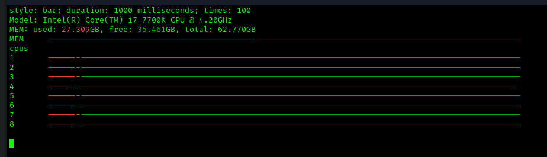
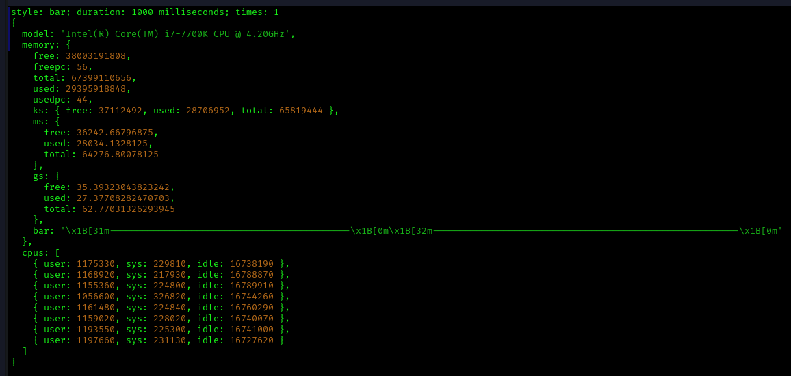
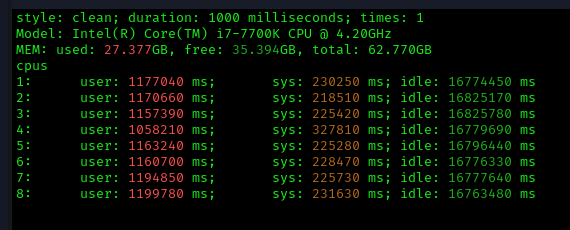

# @m1yh3m/cpu.info.node.sh

Get constant feed of your CPU in terminal

## usage

```bash

npx @m1yh3m/cpu.info.node.sh clean 1000 100

# OR

npm i -g @m1yh3m/cpu.info.node.sh

// cpu_info <style=clean|raw|bar> <duration=N> <times=N>
cpu_info clean 1000 100

```

### `cpu_info bar 1000 100`



### `cpu_info raw 1000 1`



### `cpu_info clean 1000 1`


